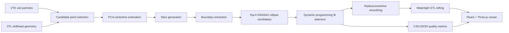

# Pipeline Architecture

## Overview

The project has two main systems:

1. A Python scientific-computing pipeline that reconstructs borehole geometry from VTK/STL simulation data.
2. A static React/Three.js viewer that visualizes the exported STL and reconstruction quality metrics.

## Reconstruction Pipeline

The main entry point is `borehole_piecewise_surface.py`.

Core stages:

- Load VTK point-cloud data and STL tool geometry.
- Mirror soil points to recover the symmetric side of the simulation.
- Use spatial proximity to the drillhead mesh to identify likely borehole-region particles.
- Estimate the borehole centerline using PCA.
- Slice the candidate points along the centerline.
- Extract boundary candidates from each slice using gradient, radial, or hybrid boundary modes.
- Fit ellipse candidates with RANSAC.
- Choose a globally smooth sequence of fits using dynamic programming.
- Smooth slice radii and centers.
- Loft rings into a watertight STL mesh.
- Export summary metrics and per-slice metrics.

## Fit Selection

The strongest model upgrade is global fit selection. Instead of accepting each slice independently, each slice can keep multiple RANSAC candidates. The dynamic-programming stage then chooses the candidate path that balances:

- per-slice fit quality
- neighboring-slice smoothness
- radius continuity
- physically plausible geometry

This makes the model less likely to produce spliced or jagged surfaces from isolated bad fits.

## Viewer

The viewer lives in `viewer-react/`.

It imports the generated output artifacts:

- `outputs/borehole_final_smooth.stl`
- `outputs/borehole_summary.json`
- `outputs/borehole_slice_metrics.csv`

The viewer renders the STL in Three.js and can color the mesh by per-slice cavity quality. The production deployment serves the built static app from `viewer-react/dist`.

## Evaluation

`borehole_evaluation.py` compares reconstruction runs and writes:

- `docs/model_evaluation.md`
- `docs/model_evaluation.csv`

The current report compares the original run, the 2750000 single-candidate run, the 2750000 dynamic-programming run, and the radial/gradient hybrid experiment.
